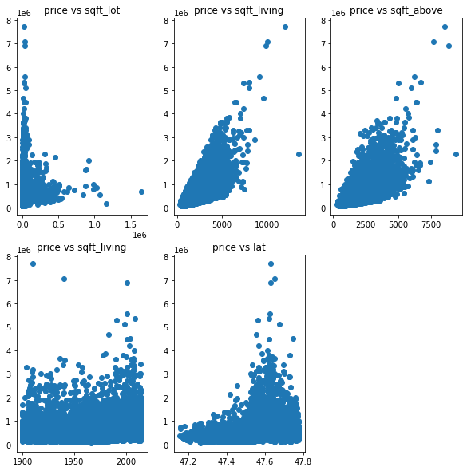
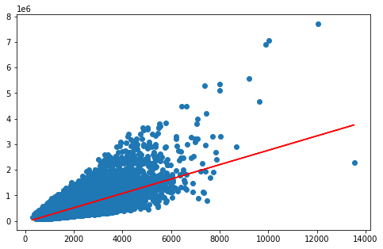
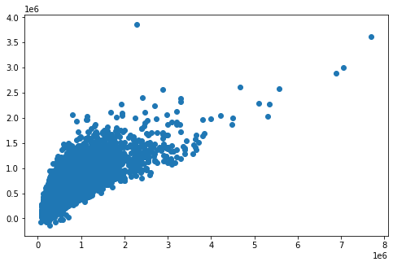

## 线性回归预测房价
**任务：**
基于usa_housing_price.csv数据，建立线性回归模型，预测合理房价

- 以sqft_living为输入变量，建立单因子模型，评估模型表现，可视化线性回归预测结果
- 以sqft_living、sqft_lot、sqft_above、yr_built、lat为输入变量，建立多因子模型，评估模型表现
- 预测sqft_living=1180、sqft_lot=5650、sqft_above=1180、yr_built=1955、lat=47.5112的合理房价


```python
# load the data
import pandas as pd
import numpy as np
data = pd.read_csv('usa_housing_price.csv')
data.head()
```


<div>
<style scoped>
    .dataframe tbody tr th:only-of-type {
        vertical-align: middle;
    }

    .dataframe tbody tr th {
        vertical-align: top;
    }
    
    .dataframe thead th {
        text-align: right;
    }
</style>
<table border="1" class="dataframe">
  <thead>
    <tr style="text-align: right;">
      <th></th>
      <th>price</th>
      <th>sqft_living</th>
      <th>sqft_lot</th>
      <th>sqft_above</th>
      <th>yr_built</th>
      <th>lat</th>
    </tr>
  </thead>
  <tbody>
    <tr>
      <th>0</th>
      <td>221900.0</td>
      <td>1180</td>
      <td>5650</td>
      <td>1180</td>
      <td>1955</td>
      <td>47.5112</td>
    </tr>
    <tr>
      <th>1</th>
      <td>538000.0</td>
      <td>2570</td>
      <td>7242</td>
      <td>2170</td>
      <td>1951</td>
      <td>47.7210</td>
    </tr>
    <tr>
      <th>2</th>
      <td>180000.0</td>
      <td>770</td>
      <td>10000</td>
      <td>770</td>
      <td>1933</td>
      <td>47.7379</td>
    </tr>
    <tr>
      <th>3</th>
      <td>604000.0</td>
      <td>1960</td>
      <td>5000</td>
      <td>1050</td>
      <td>1965</td>
      <td>47.5208</td>
    </tr>
    <tr>
      <th>4</th>
      <td>510000.0</td>
      <td>1680</td>
      <td>8080</td>
      <td>1680</td>
      <td>1987</td>
      <td>47.6168</td>
    </tr>
  </tbody>
</table>
</div>


```python
%matplotlib inline
from matplotlib import pyplot as plt
fig = plt.figure(figsize = (10,10))
fig1 = plt.subplot(231)
plt.scatter(data.loc[:,'sqft_lot'],data.loc[:,'price'])
plt.title('price vs sqft_lot')

fig2 = plt.subplot(232)
plt.scatter(data.loc[:,'sqft_living'],data.loc[:,'price'])
plt.title('price vs sqft_living')

fig3 = plt.subplot(233)
plt.scatter(data.loc[:,'sqft_above'],data.loc[:,'price'])
plt.title('price vs sqft_above')

fig4 = plt.subplot(234)
plt.scatter(data.loc[:,'yr_built'],data.loc[:,'price'])
plt.title('price vs sqft_living')

fig5 = plt.subplot(235)
plt.scatter(data.loc[:,'lat'],data.loc[:,'price'])
plt.title('price vs lat')


plt.show()
```





```python
#define X and y
X = data.loc[:,'sqft_living']
y = data.loc[:,'price']
y.head()
```


    0    221900.0
    1    538000.0
    2    180000.0
    3    604000.0
    4    510000.0
    Name: price, dtype: float64


```python
X = np.array(X).reshape(-1,1)
print(X.shape)
```

    (21613, 1)


```python
# set up the linear regression model
from sklearn.linear_model import LinearRegression
LR1 = LinearRegression()
# train the model
LR1.fit(X,y)
```


    LinearRegression()


```python
# Calculate the price vs sqft_living
y_predict_1 = LR1.predict(X)
print(y_predict_1)
```

    [287484.29258296 677805.59158496 172353.54971186 ... 242555.22219424
     405423.10235335 242555.22219424]


```python
# evaluate the model
from sklearn.metrics import mean_squared_error,r2_score
mean_squared_error_1 = mean_squared_error(y,y_predict_1)
r2_score_1 = r2_score(y,y_predict_1)
print(mean_squared_error_1,r2_score_1)
```

    68437189845.45986 0.4928653865220143


```python
fig6 = plt.figure(figsize=(8,5))
plt.scatter(X,y)
plt.plot(X,y_predict_1,'r')
plt.show()
```





```python
# define X_multi
X_multi = data.drop(['price'],axis=1)
X_multi

```


<div>
<style scoped>
    .dataframe tbody tr th:only-of-type {
        vertical-align: middle;
    }

    .dataframe tbody tr th {
        vertical-align: top;
    }
    
    .dataframe thead th {
        text-align: right;
    }
</style>
<table border="1" class="dataframe">
  <thead>
    <tr style="text-align: right;">
      <th></th>
      <th>sqft_living</th>
      <th>sqft_lot</th>
      <th>sqft_above</th>
      <th>yr_built</th>
      <th>lat</th>
    </tr>
  </thead>
  <tbody>
    <tr>
      <th>0</th>
      <td>1180</td>
      <td>5650</td>
      <td>1180</td>
      <td>1955</td>
      <td>47.5112</td>
    </tr>
    <tr>
      <th>1</th>
      <td>2570</td>
      <td>7242</td>
      <td>2170</td>
      <td>1951</td>
      <td>47.7210</td>
    </tr>
    <tr>
      <th>2</th>
      <td>770</td>
      <td>10000</td>
      <td>770</td>
      <td>1933</td>
      <td>47.7379</td>
    </tr>
    <tr>
      <th>3</th>
      <td>1960</td>
      <td>5000</td>
      <td>1050</td>
      <td>1965</td>
      <td>47.5208</td>
    </tr>
    <tr>
      <th>4</th>
      <td>1680</td>
      <td>8080</td>
      <td>1680</td>
      <td>1987</td>
      <td>47.6168</td>
    </tr>
    <tr>
      <th>...</th>
      <td>...</td>
      <td>...</td>
      <td>...</td>
      <td>...</td>
      <td>...</td>
    </tr>
    <tr>
      <th>21608</th>
      <td>1530</td>
      <td>1131</td>
      <td>1530</td>
      <td>2009</td>
      <td>47.6993</td>
    </tr>
    <tr>
      <th>21609</th>
      <td>2310</td>
      <td>5813</td>
      <td>2310</td>
      <td>2014</td>
      <td>47.5107</td>
    </tr>
    <tr>
      <th>21610</th>
      <td>1020</td>
      <td>1350</td>
      <td>1020</td>
      <td>2009</td>
      <td>47.5944</td>
    </tr>
    <tr>
      <th>21611</th>
      <td>1600</td>
      <td>2388</td>
      <td>1600</td>
      <td>2004</td>
      <td>47.5345</td>
    </tr>
    <tr>
      <th>21612</th>
      <td>1020</td>
      <td>1076</td>
      <td>1020</td>
      <td>2008</td>
      <td>47.5941</td>
    </tr>
  </tbody>
</table>
<p>21613 rows × 5 columns</p>
</div>


```python
# set up 2nd linear model
LR_multi = LinearRegression()
#train the model
LR_multi.fit(X_multi,y)
```


    LinearRegression()


```python
# make prediction
y_predict_multi = LR_multi.predict(X_multi)
print(y_predict_multi)
```

    [279081.29418243 832377.00440778 346082.19661749 ... 176687.80346459
     325324.21431742 178529.30559747]


```python
mean_squared_error_multi = mean_squared_error(y,y_predict_multi)
r2_score_multi = r2_score(y,y_predict_multi)
print(mean_squared_error_multi,r2_score_multi)
```

    55814504752.37977 0.5864022564634701


```python
fig7 = plt.figure(figsize=(8,5))
plt.scatter(y,y_predict_multi)
plt.show()
```





```python
X_test = [1180,5650,1180,1955,47.5112]
X_test = np.array(X_test).reshape(1,-1)
print(X_test)
```

    [[1180.     5650.     1180.     1955.       47.5112]]


```python
y_test_predict = LR_multi.predict(X_test)
print(y_test_predict)
```

    [279081.29418243]

