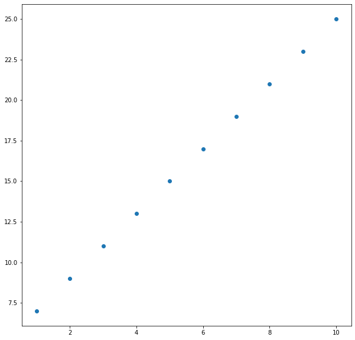
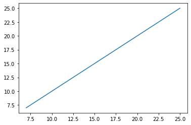

## LR实现线性预测
任务：
基于generated_data.csv数据，建立线性回归模型，预测x = 3.5对应的y值，评估模型表现


```python
# load the data
import pandas as pd
data = pd.read_csv('generated_data.csv')
data.head()
print(type(data),data.shape)
```

    <class 'pandas.core.frame.DataFrame'> (10, 2)
    


```python
#data赋值
x = data.loc[:,'x']
y = data.loc[:,'y']
print(x,y)
```

    0     1
    1     2
    2     3
    3     4
    4     5
    5     6
    6     7
    7     8
    8     9
    9    10
    Name: x, dtype: int64 0     7
    1     9
    2    11
    3    13
    4    15
    5    17
    6    19
    7    21
    8    23
    9    25
    Name: y, dtype: int64
    


```python
#visualize the data
from matplotlib import pyplot as plt
plt.figure(figsize=(10,10))
plt.scatter(x,y)
plt.show()
```





```python
# set up a linear regression model
from sklearn.linear_model import LinearRegression
lr_model = LinearRegression()
print(type(x),x.shape)
```

    <class 'pandas.core.series.Series'> (10,)
    


```python
# 维度转换
import numpy as np
x = np.array(x)
x = x.reshape(-1,1)
#y = np.array(y)
#y = y.reshape(-1,1)
print(type(x),x.shape,type(y),y.shape)
```

    <class 'numpy.ndarray'> (10, 1) <class 'pandas.core.series.Series'> (10,)
    


```python
# 模型拟合,所有实际的点都在线性回归上
lr_model.fit(x,y)
y_predict = lr_model.predict(x)
print(y_predict)
y_3 = lr_model.predict([[3.5]])
print(y_3)
```

    [ 7.  9. 11. 13. 15. 17. 19. 21. 23. 25.]
    [12.]
    


```python
# a/b 打印
a = lr_model.coef_
b = lr_model.intercept_
print(a,b)
```

    [[2.]] [5.]
    


```python
from sklearn.metrics import mean_squared_error,r2_score
MSE = mean_squared_error(y,y_predict)
R2 = r2_score(y,y_predict)
print(MSE,R2)
```

    3.1554436208840474e-31 1.0
    


```python
plt.figure()
plt.plot(y,y_predict)
plt.show()
```




